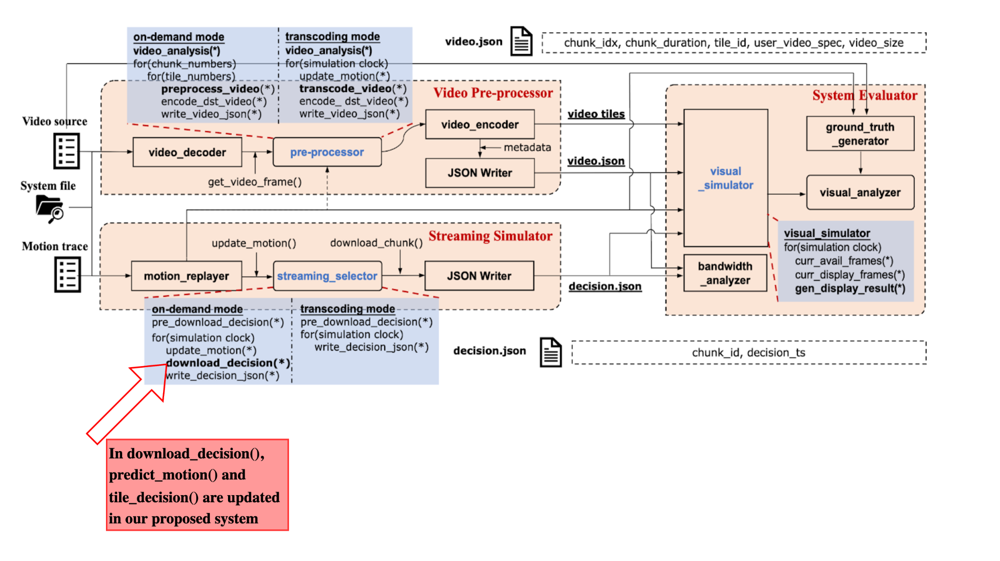
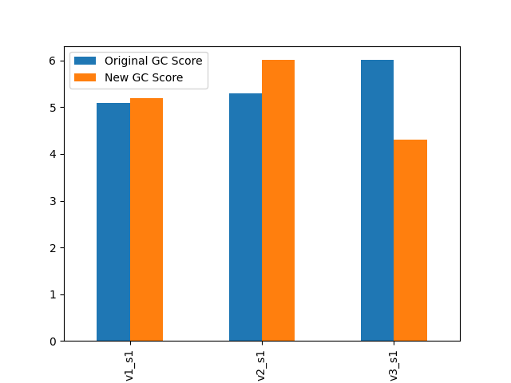
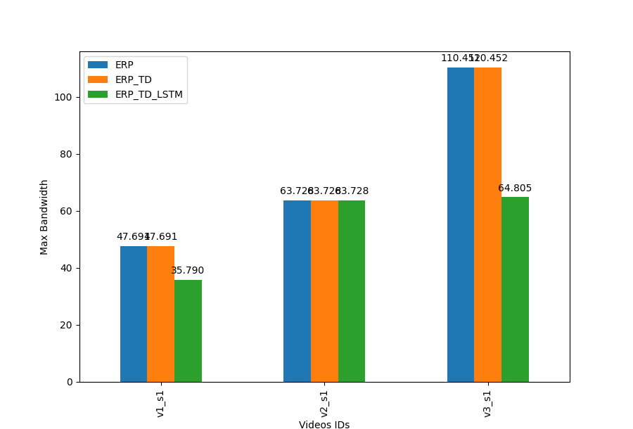
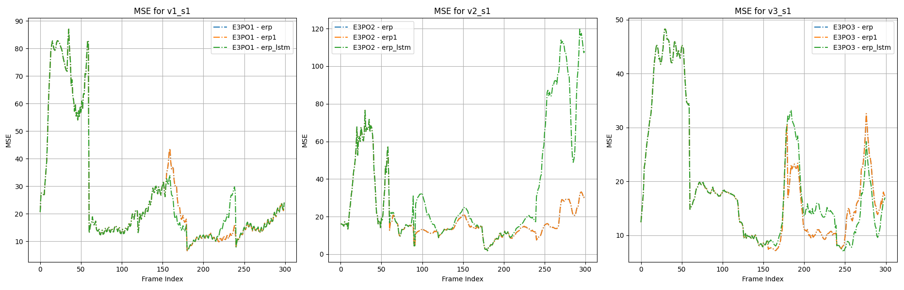
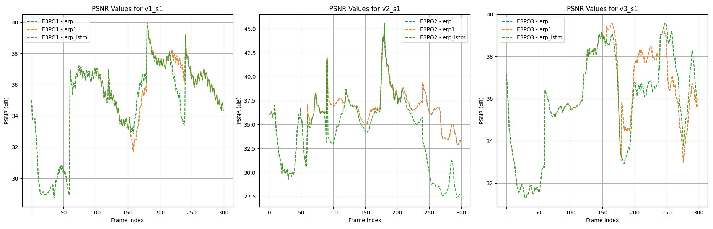

MMSys'24 Grand Challenge Project, done as part of the Multimedia Networking and Systems Course (Spring'24) at NTHU.

# Running Steps
```
python ./e3po/make_preprocessing.py -approach_name erp_lstm_dec -approach_type on_demand
python ./e3po/make_decision.py -approach_name erp_lstm_dec -approach_type on_demand
python ./e3po/make_evaluation.py -approach_name erp_lstm_dec -approach_type on_demand
```
Also relevant approach: `erp_lstm`

# Preliminary Research
The initial ideas for the project were to tweak some values in the code to see if an improvement in GC score could be observed.
The exponential smoothing approach of the original method used a coefficient of 0.3. Increases or decreases in the coefficient either worsened the final scores of all methods, or produced a negligible difference.

On the tiling side, we had attempted to increase the number of tiles in the default ERP approach. This resulted in a small decrease in overall GC score.
Some other approaches were looked at, mostly for inspiration, as what was feasible to implement was much simpler.
## Preprocessing
Tiling methods and projections were to be investigated on this side of the project. We explored sources from earlier MMSys symposiums as a starting point[1].
An FoV-based caching strategy was showing in [4], which took into account network latency and similar concerns. We we unsure of how to correctly use the ideas in E3PO.
## Tile Decision
Rondon et al.[2] made a cumulative study on several researched methodologies that were used for head motion prediction. Among these approaches a large number of methods made use of an LSTM model, the idea which made it to our final draft. An extension to an LSTM based approach was also explored in [3] and [5], but was not implemented.
For tile prediction, a Deep Learning based method can be found in [6], but was left ignored as it used an amount of resources that made it infeasible to implement and test on our hardware.

# Proposed System 


<i>Updated Proposed System Architecture</i>

## Motion Prediction LSTM
The given code uses a simple LSTM model with a window size of 3 to predict future motions. It also uses special smoothing code in order to make sure the tile decision does not overshoot the intended tiles to be downloaded.
In later discussion we understood that the model could simply overfit the dataset to perfectly mirror the head movement. However, this method is not done with that guarantee as it receives points on-the-fly, and hence attempts to perform an inexact, general fit that may work for a larger range of motion data.

## Motion Intensity Based Tile Decision
This function is responsible for making decisions regarding which tiles to transmit based on enhanced prediction accuracy and adaptive sampling. The calculation of motion intensity using the square root of the sum of squares of yaw and pitch predictions is based on vector magnitude. In the context of 360° video streaming, the motion of the camera or viewpoint is often represented in terms of yaw and pitch angles. Yaw typically represents horizontal rotation, while pitch represents vertical rotation. These angles indicate the direction in which the camera is pointing or moving. To calculate the overall motion intensity, the yaw and pitch predictions are treated as components of a 2D vector. By taking the square of each component, summing them, and then taking the square root of the result, we obtain the magnitude of this vector. Mathematically, if denote the yaw prediction as y and the pitch prediction as p, then the motion intensity M is calculated as: 

$$ M = sqrt(y^2 + p^2) $$

And then calculates an adaptive sampling size based on the intensity of motion. First, calculates an intensity factor by dividing motion_intensity by 10 and then clipping the result between 0.5 and 2, where a value greater than 1 indicates higher motion intensity necessitating finer sampling to capture more details, and a value less than 1 means the motion is less intense, allowing for coarser sampling. After that it got the adaptive sampling size by scaling each dimension of the base sampling size by the intensity factor.

# Experimental Results
The experiments were done upon three different videos from the given test cases, as in the initial assignment (v1_s1, v2_s1, v3_s1 and their respective motion traces).

Figure 1 is to show the GC Scores for original erp method and final method (lstm and updated tile decision). The picture depicts that GC Scores is better in two out of three videos. 



*Fig 1. Comparison of GC Scores for 3 Methods: ERP Vs ERP with Updated Tile Decision (ERP1) Vs ERP with LSTM and Updated Tile Decision (ERP_LSTM)*



*Fig 2. Comparison of Max Bandwidth usage by 3 Methods: ERP Vs ERP with Updated Tile Decision (ERP1) Vs ERP with LSTM and Updated Tile Decision (ERP_LSTM)*

In figure 2, there is a comparison of max bandwidth usage between three methods of original erp, erp with updated tile decision methods and erp with lstm and  updated tile decision. We can see that there is not much difference between the first and second method. But with the lstm method, it reduced the bandwidth usage compared to two other methods. 



*Fig 3. Comparison of MSE Values for 3 Methods: ERP Vs ERP with Updated Tile Decision (ERP1) Vs ERP with LSTM and Updated Tile Decision (ERP_LSTM)*

Figure 3 mentions the line plot of MSE values between three methods. In that figure, erp with lstm with updated tile decision outperforms the other two methods. 



*Fig 4. Comparison of PSNR Values for 3 Methods: ERP Vs ERP with Updated Tile Decision (ERP1) Vs ERP with LSTM and Updated Tile Decision (ERP_LSTM)*

In figure 4, the PSNR value with lstm method is better in video 1 and 3 higher than video 2, in which erp1 (only with updated tile decision) is better.  

# Conclusion
The current approach performs on the shown test cases but requires more fine tuning on bespoke videos and motion captures.
Many basic portions of E3PO can be explored: customised tiling logic, and overall assembly method. We have not pushed the limits of how much bandwidth we can abuse to avoid data loss.
More experimentation can be done to find optimal window size, better projection methods to avoid data loss.

# References
1. Fernández-Dasí, Miguel, Mario Montagud, and Josep Paradells Aspas. “Design, Development and Evaluation of Adaptative and Interactive Solutions for High-Quality Viewport-Aware VR360 Video Processing and Delivery: Research Proposal.” In Proceedings of the 13th ACM Multimedia Systems Conference, 367–71. MMSys ’22. New York, NY, USA: Association for Computing Machinery, 2022. https://doi.org/10.1145/3524273.3533929.
2. Rondón, Miguel Fabián Romero, Lucile Sassatelli, Ramón Aparicio-Pardo, and Frédéric Precioso. “A Unified Evaluation Framework for Head Motion Prediction Methods in 360° Videos.” In Proceedings of the 11th ACM Multimedia Systems Conference, 279–84. Istanbul Turkey: ACM, 2020. https://doi.org/10.1145/3339825.3394934.
3. “Sensors | Free Full-Text | Prediction of Head Movement in 360-Degree Videos Using Attention Model.” Accessed April 17, 2024. https://www.mdpi.com/1424-8220/21/11/3678.
4. Sun, Liyang, Yixiang Mao, Tongyu Zong, Yong Liu, and Yao Wang. “Flocking-Based Live Streaming of 360-Degree Video.” In Proceedings of the 11th ACM Multimedia Systems Conference, 26–37. MMSys ’20. New York, NY, USA: Association for Computing Machinery, 2020. https://doi.org/10.1145/3339825.3391856.
5. Xu, Yanyu, Yanbing Dong, Junru Wu, Zhengzhong Sun, Zhiru Shi, Jingyi Yu, and Shenghua Gao. “Gaze Prediction in Dynamic 360° Immersive Videos.” In 2018 IEEE/CVF Conference on Computer Vision and Pattern Recognition, 5333–42. Salt Lake City, UT, USA: IEEE, 2018. https://doi.org/10.1109/CVPR.2018.00559.
6. Yaqoob, Abid, and Gabriel-Miro Muntean. “Advanced Predictive Tile Selection Using Dynamic Tiling for Prioritized 360° Video VR Streaming.” ACM Transactions on Multimedia Computing, Communications, and Applications 20, no. 1 (August 24, 2023): 6:1-6:28. https://doi.org/10.1145/3603146.
